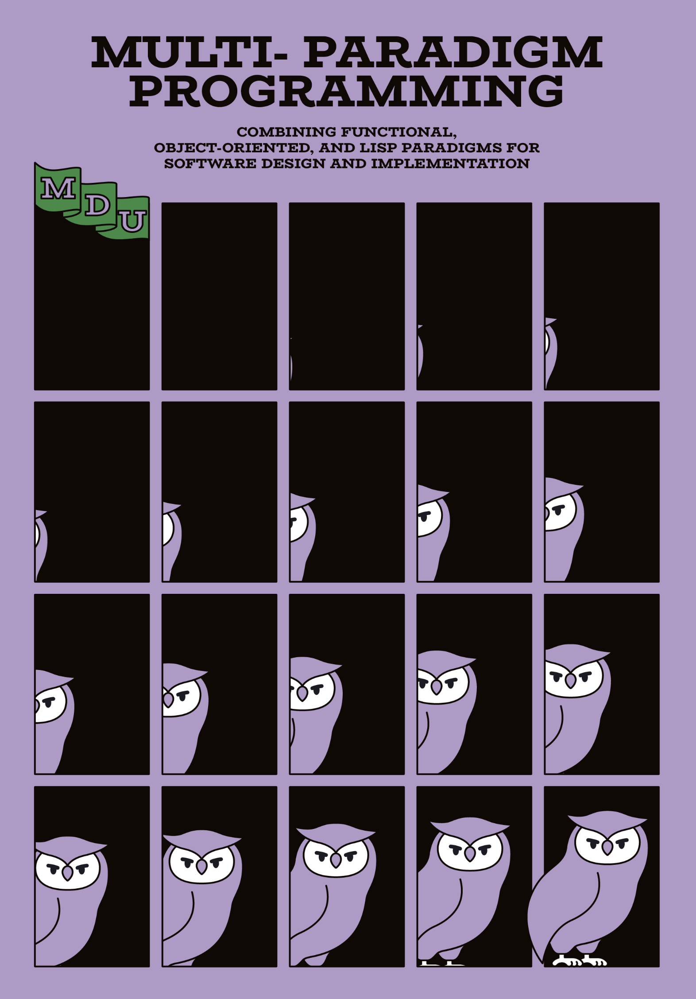

[English](#multi-paradigm-programming) | [한국어](https://github.com/marpple/multi-paradigm-programming)  

<a href="book/en/README.md"></a>&nbsp;&nbsp;<a href="book/ko/README.md"></a>&nbsp;

---

# Multi-Paradigm Programming

Combining Object-Oriented, Functional, and Imperative Approaches for Software Development and Design ([Get Started](book/en/README.md) 🧐)

## 📖 Table of Contents (Book)

[View Detailed Table of Contents](book/en/README.md) <br>
[From the Author](book/en/0.1-From-the-Author.md) <br>
[Endorsements](book/en/0.2-Endorsements.md) <br>

1. [How Multiparadigm Is Expanding Modern Languages](book/en/1.0.-How-Multiparadigm-Is-Expanding-Modern-Languages.md)
2. [Functional Programming, Type Systems, and Lisp](book/en/2.0-Functional-Programming,-Type-Systems,-and-Lisp.md)
3. [Code:Object:Function = Generator:Iterator:LISP = IP:OOP:FP](book/en/3.0-Code%3AObject%3AFunction-=-Generator%3AIterator%3ALISP-=-IP%3AOOP%3AFP.md)
4. Asynchronous Programming
5. Practical Functional Programming
6. Multi-Paradigm Programming
7. Object-Oriented Front-End Development and Multi-Paradigm Approaches in Practice

## 🚀 Quick Menu

- [Project Setup](#%EF%B8%8F-project-setup)
- [Video ](#-video-course)
- [License & Copyright](#-license--copyright)

## 🛠️ Project Setup

### Node.js with Volta

[Volta Guide](https://docs.volta.sh/guide/getting-started)

### Unix Installation

```shell
curl https://get.volta.sh | bash
volta install node@22
```

### Windows Installation

```shell
winget install Volta.Volta
volta install node@22
```

### pnpm

[pnpm Guide](https://docs.volta.sh/guide/getting-started)

```bash
npm install -g pnpm@10
```

### Installing and Running the Book Examples

```
pnpm install
pnpm -F example dev
```

1. Open the terminal, run the code above, and then navigate to http://localhost:2118/. 
2. The book’s example code can be found in [/apps/example/src/chapters](./apps/example/src/chapters).

### Installing and Running the Video Course Examples

```
pnpm install
pnpm -F example dev
```

1. Open the terminal, run the code above, and then navigate to http://localhost:7000/. 
2. The video-lecture example code is located in [/apps/lecture/src/part-*](./apps/lecture/src).

## 🎥 Video Course

You can take various video courses related to this book on Inflearn. These courses are conducted in a live coding format, allowing you to see the code evolve in real-time for a more detailed and intuitive learning experience.

#### Go to the Multi-Paradigm Programming Video Course 🖥️

- [English](https://www.inflearn.com/en/course/multi-paradigm-programming)
- [日本語](https://www.inflearn.com/ja/course/multi-paradigm-programming)
- [Tiếng Việt](https://www.inflearn.com/vi/course/multi-paradigm-programming) 

> Inflearn sponsors the creation of learning content related to "Multi-Paradigm Programming."
>
> <a href="https://www.inflearn.com/en/"></a>

## 📝 Publication

The Korean version of **『Multi-Paradigm Programming』** is published by [Hanbit Media](https://www.hanbit.co.kr/).

## 📜 License & Copyright

All example codes in this repository are licensed under the MIT License. However, the original book text and any text partially disclosed in this repository are licensed under [CC BY-NC-SA](https://creativecommons.org/licenses/by-nc-sa/4.0/).

> The materials herein are all © 2025 [Marpple Corporation](https://www.marpplecorp.com/).
>
> <a href="https://www.marpplecorp.com/"></a>

